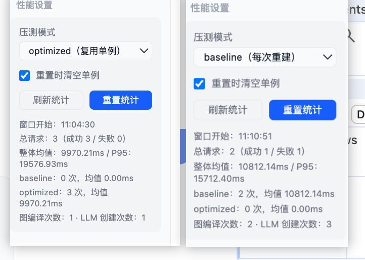

# Unified 性能测试与统计说明

本文档用于说明 `unified` 链路的性能采集、前后对比压测方法，以及前端“性能设置”模块的使用方式。

## 1. 目标

- 定位并量化 `LLM 实例重复创建` 与 `LangGraph 重复编译` 带来的额外耗时。
- 提供统一采集口径，支持 `baseline`（优化前）与 `optimized`（优化后）同代码对比。
- 在前端直接查看统计结果，减少手工计算成本。

## 2. 核心机制

### 2.1 两种压测模式

- `baseline`：每次请求都重新创建 LLM、重新编译 Graph（模拟优化前）。
- `optimized`：全局复用单例实例（模拟优化后）。

通过请求头控制：

```http
x-unified-benchmark-mode: baseline | optimized
```

未传时默认 `optimized`。

### 2.2 采集内容

每次请求会记录：

- 请求耗时（`durationMs`）
- 采样模式（`mode`）
- 请求是否成功（`success`）
- 请求开始/结束时间
- 请求上下文长度（`messageLength`、`historyLength`）
- 意图分类（`intent`，若可用）

同时维护聚合统计：

- 总请求、成功数、失败数
- 平均耗时、最小耗时、最大耗时、P95
- 分模式统计（`baseline` / `optimized` 的样本数与均值）
- 运行态计数（`graphCompileCount`、`llmCreateCount`）

## 3. 后端接口

### 3.1 统一问答接口

- `POST /api/chat/unified`

请求体：

```json
{
  "message": "画一只蓝色猫咪"
}
```

可选请求头：

```http
x-unified-benchmark-mode: baseline
```

### 3.2 查询性能统计

- `GET /api/chat/unified-metrics`

响应结构（简化）：

```json
{
  "code": 200,
  "success": true,
  "data": {
    "performance": {
      "totalRequests": 24,
      "averageDurationMs": 1120.46,
      "p95DurationMs": 1930.22,
      "modeSummary": {
        "baseline": {
          "requestCount": 12,
          "averageDurationMs": 1620.58
        },
        "optimized": {
          "requestCount": 12,
          "averageDurationMs": 620.34
        }
      }
    },
    "runtime": {
      "graphCompileCount": 13,
      "llmCreateCount": 25
    }
  }
}
```

### 3.3 重置性能统计

- `POST /api/chat/unified-metrics-reset`

请求体：

```json
{
  "resetSingletons": true
}
```

字段说明：

- `resetSingletons=true`：重置统计的同时，清空图和 LLM 单例。
- `resetSingletons=false`：仅清空统计窗口，不清空单例。

## 4. 前端“性能设置”模块

页面：`/unified`

可操作项：

- 切换压测模式（`optimized` / `baseline`）
- 刷新统计
- 重置统计（可勾选“重置时清空单例”）

可查看指标：

- 总请求、成功/失败、整体均值、P95
- `baseline` 与 `optimized` 的样本数和平均耗时
- 优化降幅（自动计算）
- 图编译次数与 LLM 创建次数

## 5. 推荐压测流程（10~20 次）

1. 调用重置接口，建议 `resetSingletons=true`。
2. 选择 `baseline`，连续发送 10~20 次相同请求。
3. 切换到 `optimized`，再发送 10~20 次相同请求。
4. 查看 `modeSummary` 两组均值并计算降幅。
5. 同时观察 `graphCompileCount`、`llmCreateCount` 是否符合预期。

## 6. 降幅计算公式

```text
耗时降幅(%) = (baseline_avg - optimized_avg) / baseline_avg * 100
```

示例：

- `baseline_avg = 1500ms`
- `optimized_avg = 600ms`
- 降幅 `= (1500 - 600) / 1500 = 60%`

## 7. 注意事项

- 建议使用同一类请求内容进行对比，避免提示词复杂度差异影响结果。
- 首次请求可能包含冷启动抖动，可在每组多发 1~2 次后再统计。
- 网络波动会影响图片生成请求耗时，建议观察 P95 与均值综合判断。
- 当前统计为进程内内存数据，服务重启后会清空。


## 结果分析

